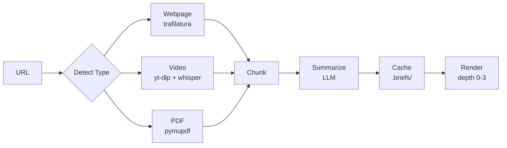

<p align="center">
  
  <br>
  <strong>.brief</strong>
  <br>
  <em>extract once, render per query</em>
</p>

# Brief

When AI agents research a topic, they run into a few problems:

- **Token cost** — reading a full webpage can burn 5,000+ tokens, and most of it isn't relevant to the question at hand.
- **Duplicate work** — if two agents research the same topic, they each extract everything from scratch.
- **Inconsistency** — re-visiting a URL might produce slightly different content each time.

Brief addresses these by extracting content once (from webpages, videos, and PDFs), compressing it into a structured summary, and caching it. Agents can then scan 10 sources in ~100 tokens, pick the ones that matter, and read those in detail.

## How It Works



Each content type has its own extractor:

- **Webpages** use [trafilatura](https://trafilatura.readthedocs.io/) to pull article text, skipping navigation, ads, and scripts.
- **Videos** use [yt-dlp](https://github.com/yt-dlp/yt-dlp) to download captions directly from YouTube's API. If no captions are available, [faster-whisper](https://github.com/SYSTRAN/faster-whisper) transcribes the audio locally. As a last resort, Brief falls back to the video's title and description.
- **PDFs** use [pymupdf](https://pymupdf.readthedocs.io/) for page-level text extraction.

After extraction, the content goes through an LLM for summarization. The summary is shaped by your query — asking about "deployment" produces a different summary than asking about "performance." If no LLM is configured, Brief falls back to a simpler heuristic (first/last paragraph + sampled key points).

Results are cached as `.brief.json` files. Calling the same URL again is instant.

## Install

```bash
pip install brief
```

For LLM-powered summaries, add your API key to a `.env` file — see [Configuration](#configuration). Without an LLM, Brief still works using heuristic summarization.

## Quick Start

### Single URL

```python
from brief import brief

text = brief("https://fastapi.tiangolo.com/", "what is fastapi", depth=1)
```

### Scan Multiple URLs

```python
from brief import brief_batch

# Get one-liner headlines for 5 URLs (~50 tokens total)
headlines = brief_batch([
    "https://docs.python.org/3/library/asyncio.html",
    "https://fastapi.tiangolo.com/",
    "https://flask.palletsprojects.com/",
], query="python async web framework", depth=0)

# Read the ones that matter in detail
detail = brief("https://fastapi.tiangolo.com/", "async support", depth=2)
```

### Compare Sources

```python
from brief import compare

result = compare(
    ["https://fastapi.tiangolo.com/", "https://flask.palletsprojects.com/"],
    query="how do they handle middleware",
    depth=2,
)
```

### Check Cache

```python
from brief import check_brief

data = check_brief("https://fastapi.tiangolo.com/")
# Returns the cached brief if it exists, None otherwise
```

## Depth Levels

Briefs are progressive — the agent controls how much detail it needs:

```
depth=0   headline     ~9 tokens      "[WEBPAGE] FastAPI — high performance web framework"
depth=1   summary      ~100 tokens    + key points, top 3 sections
depth=2   detailed     ~700 tokens    + all sections, re-ranked by query
depth=3   full         ~2000 tokens   + complete extracted text
```

Same cached data at every depth. No re-extraction.

## Interfaces

### Python

```python
from brief import brief, brief_batch, compare, check_brief

brief(uri, query, depth=1)                    # single source
brief_batch([uri1, uri2], query, depth=0)     # scan many
compare([uri1, uri2], query, depth=2)         # side-by-side
check_brief(uri)                               # cache lookup
```

### CLI

```bash
brief --uri "https://example.com" --query "key takeaways"
brief --uri "https://example.com" --depth 0
brief --list
```

### MCP (Claude, Cursor)

```bash
pip install brief[mcp]
```

```json
{
  "mcpServers": {
    "brief": {
      "command": "python",
      "args": ["-m", "brief.mcp_server"],
      "env": {
        "BRIEF_LLM_API_KEY": "sk-or-v1-your-key",
        "BRIEF_LLM_BASE_URL": "https://openrouter.ai/api/v1",
        "BRIEF_LLM_MODEL": "google/gemma-3-4b-it:free"
      }
    }
  }
}
```

### HTTP API

```bash
uvicorn brief.api:app --port 8080
```

## The `.briefs/` Folder

Every brief saves two files:

```
.briefs/
├── fastapi-tiangolo-com.brief       ← plain text
├── fastapi-tiangolo-com.brief.json  ← structured data
└── _index.sqlite3                   ← URI lookups
```

Agents with file access can browse `.briefs/` directly — no API needed.

## Configuration

Brief uses an LLM for summarization. Any OpenAI-compatible provider works. Create a `.env` file in your project root:

```bash
# OpenRouter (one key, many models)
BRIEF_LLM_API_KEY=sk-or-v1-your-key
BRIEF_LLM_BASE_URL=https://openrouter.ai/api/v1
BRIEF_LLM_MODEL=google/gemma-3-4b-it:free
```

Also works with OpenAI, Ollama (local), and Groq. See [.env.example](.env.example) for all options.

For videos without captions, Brief transcribes audio locally using `faster-whisper`. If you'd prefer cloud transcription via OpenAI's Whisper API, set:

```bash
BRIEF_STT_API_KEY=sk-your-openai-key
```

## Contributing

Brief is designed to be easy to extend. Each content type is a single file in `brief/extractors/` that implements one function:

```python
def extract(uri: str) -> list[dict[str, Any]]:
    """Return a list of chunks with 'text', 'start_sec', 'end_sec' keys."""
```

If you'd like to add support for a new content type (audio, spreadsheets, etc.), contributions are welcome.
